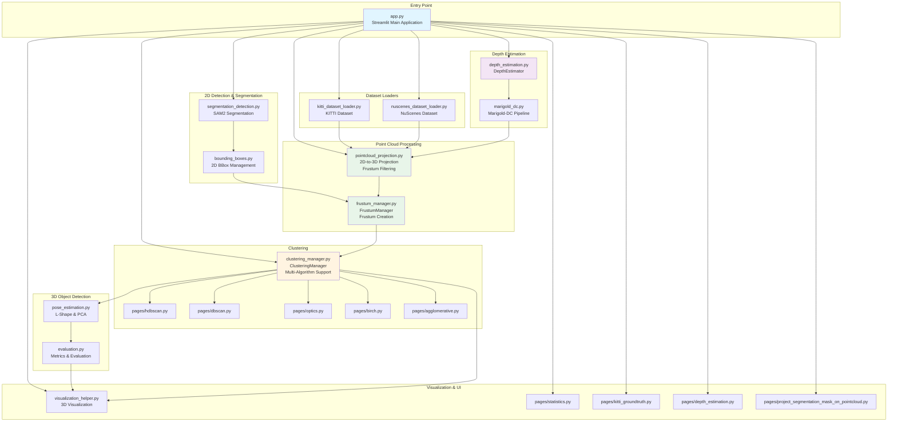
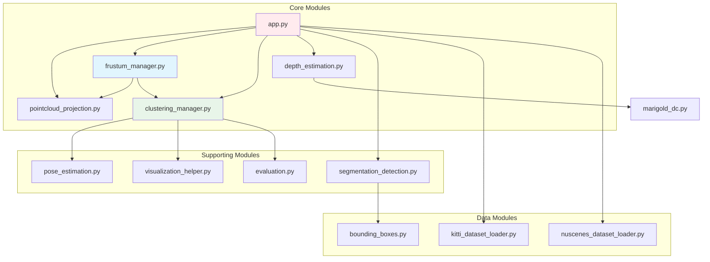

# Repository Summary - 3D Object Detection Pipeline

## Architecture Overview (Mermaid Diagram)



## Pipeline Flow

```mermaid
flowchart LR
    A[Load Dataset<br/>KITTI/NuScenes] --> B[Extract 2D BBoxes<br/>YOLO/SAM2]
    B --> C[Create Frustums<br/>2D-to-3D Projection]
    C --> D[Load LiDAR Point Cloud]
    D --> E[Ground Plane Removal<br/>RANSAC]
    E --> F[Depth Estimation<br/>Marigold-DC]
    F --> G[3D Point Reconstruction]
    G --> H[Merge with LiDAR]
    H --> I[Filter Points in Frustums]
    I --> J[Clustering<br/>HDBSCAN/DBSCAN/etc]
    J --> K[Pose Estimation<br/>L-Shape/PCA]
    K --> L[3D Cuboid Generation]
    L --> M[Evaluation & Metrics]
    M --> N[Visualization]
    
    style A fill:#e3f2fd
    style J fill:#fff3e0
    style M fill:#f1f8e9
    style N fill:#fce4ec
```



## Module Dependencies



## Key Features

### 1. **Multi-Dataset Support**
   - KITTI dataset loader
   - NuScenes dataset loader
   - Unified data format interface

### 2. **2D Detection & Segmentation**
   - SAM2 (Segment Anything Model 2) integration
   - 2D bounding box extraction
   - Segmentation mask generation

### 3. **Depth Estimation**
   - Marigold-DC for depth completion
   - Sparse depth guidance from LiDAR
   - 3D point reconstruction from depth maps

### 4. **Point Cloud Processing**
   - 2D-to-3D frustum projection
   - Ground plane removal (RANSAC)
   - Frustum-based point filtering

### 5. **Clustering Algorithms**
   - HDBSCAN (Hierarchical DBSCAN)
   - DBSCAN
   - OPTICS
   - BIRCH
   - Agglomerative Clustering

### 6. **3D Object Detection**
   - Pose estimation (L-Shape fitting, PCA)
   - 3D cuboid generation
   - Template-based cuboid sizing (KITTI statistics)

### 7. **Evaluation & Visualization**
   - Comprehensive metrics (IoU, precision, recall)
   - 3D interactive visualization
   - Statistics and comparison tools
   - Ground truth comparison

## Technology Stack

- **Framework**: Streamlit (Web UI)
- **ML Models**: SAM2, Marigold-DC, YOLO
- **Clustering**: scikit-learn (HDBSCAN, DBSCAN, OPTICS, BIRCH, Agglomerative)
- **3D Processing**: Open3D, NumPy
- **Computer Vision**: OpenCV, PIL
- **Visualization**: Plotly, Matplotlib

## File Structure

```
Project/
├── app.py                          # Main Streamlit application
├── clustering_manager.py           # Multi-algorithm clustering manager
├── pointcloud_projection.py        # 2D-to-3D projection & frustum operations
├── frustum_manager.py              # Frustum creation & management
├── depth_estimation.py             # Depth estimation & 3D reconstruction
├── marigold_dc.py                  # Marigold-DC depth completion
├── segmentation_detection.py       # SAM2 segmentation integration
├── pose_estimation.py              # Object pose estimation (L-Shape, PCA)
├── evaluation.py                   # Metrics & evaluation functions
├── visualization_helper.py         # 3D visualization utilities
├── kitti_dataset_loader.py         # KITTI dataset loader
├── nuscenes_dataset_loader.py      # NuScenes dataset loader
├── bounding_boxes.py               # 2D bounding box management
├── pages/                          # Streamlit page modules
│   ├── hdbscan.py
│   ├── dbscan.py
│   ├── optics.py
│   ├── birch.py
│   ├── agglomerative.py
│   ├── statistics.py
│   ├── depth_estimation.py
│   ├── kitti_groundtruth.py
│   └── project_segmentation_mask_on_pointcloud.py
└── dataset/                         # Dataset storage
    ├── kitti/
    └── nuscenes/
```

